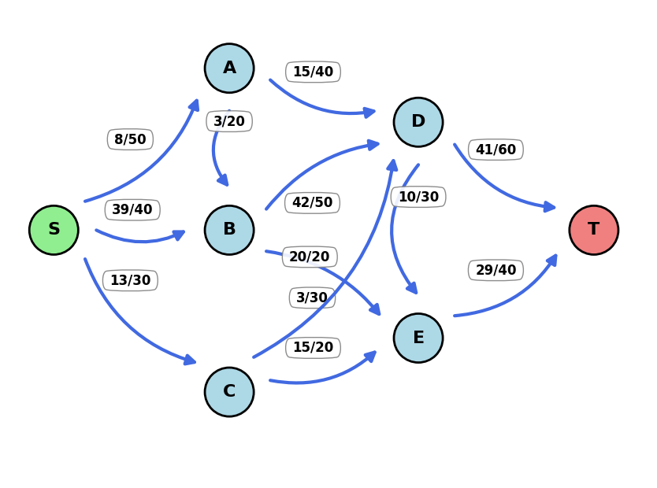
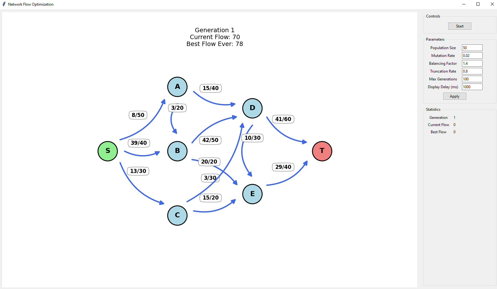

# Bài Toán Luồng Cực Đại trong Mạng Hậu Cần

## 1. Giới Thiệu Bài Toán

### Bối Cảnh
Một công ty hậu cần cần tối ưu hóa việc vận chuyển hàng hóa từ kho trung tâm (S) đến điểm đích cuối cùng (T) thông qua một mạng lưới các kho trung gian và tuyến đường vận chuyển.

### Cấu Trúc Mạng
- **Điểm Nguồn (S)**: Kho trung tâm, có khả năng xử lý 120 gói hàng/ngày
- **Các Điểm Trung Gian**:
  - Kho A: Kết nối với nhiều tuyến vận chuyển
  - Trung tâm B: Điểm phân phối không phục vụ trực tiếp
  - Kho C: Kho vùng nhỏ
  - Điểm D: Điểm tập trung hàng về đích
  - Kho E: Kho vùng song song
- **Điểm Đích (T)**: Điểm tập kết cuối cùng

### Công Suất Các Tuyến (gói hàng/ngày)

- S → A: 50 
- A → D: 40 
- C → E: 20 
- A → B: 20
- S → B: 40 
- B → D: 50 
- E → T: 40 
- D → E: 30
- S → C: 30 
- C → D: 20 
- B → E: 30 
- D → T: 60

### Mạng Logistics


### Mục Tiêu
Tìm số lượng gói hàng tối đa có thể vận chuyển từ S đến T, đảm bảo không vượt quá công suất của bất kỳ tuyến đường nào.

## 2. Hướng Dẫn Cài Đặt

### Yêu Cầu Hệ Thống
- Python 3.8 trở lên
- Git

### Các Bước Cài Đặt

1. **Clone Repository**

```bash
git clone [URL_repository]
cd [tên_thư_mục]
```

2. **Tạo Môi Trường Ảo**
```bash
# Windows
python -m venv venv
venv\Scripts\activate

# Linux/Mac
python3 -m venv venv
source venv/bin/activate
```

3. **Cài Đặt Thư Viện**
```bash
pip install networkx matplotlib numpy tkinter ipython
```

4. **Khởi Chạy Chương Trình**
```bash
python main.py
```

### Sử Dụng Chương Trình



1. **Giao Diện Chính**
- Bên trái: Hiển thị đồ thị mạng
- Bên phải: Bảng điều khiển và thống kê

2. **Các Tham Số Điều Chỉnh**
- Population Size: Kích thước quần thể (mặc định: 50)
- Mutation Rate: Tỷ lệ đột biến (mặc định: 0.02)
- Balancing Factor: Hệ số cân bằng (mặc định: 1.4)
- Truncation Rate: Tỷ lệ cắt bỏ (mặc định: 0.8)
- Max Generations: Số thế hệ tối đa
- Display Delay: Độ trễ hiển thị (ms)

3. **Điều Khiển**
- Start: Bắt đầu mô phỏng
- Stop: Dừng mô phỏng
- Apply: Áp dụng thay đổi tham số

4. **Thông Tin Hiển Thị**
- Generation: Thế hệ hiện tại
- Current Flow: Luồng hiện tại
- Best Flow: Luồng tốt nhất tìm được

### Lưu Ý
- Đảm bảo tất cả thư viện được cài đặt đầy đủ
- Có thể điều chỉnh các tham số trong quá trình chạy
- Chương trình sẽ hiển thị kết quả tốt nhất sau khi hoàn thành


### Tham khảo
- [Documentation](https://docs.google.com/document/d/1GS3FqorM6rPBtcU-r2f7IeRFNeqTVMBy_1WWFJNYoR0/edit?tab=t.0#heading=h.kxamao79tale)

### Thành viên đóng góp
- Huỳnh Thiên Văn
- Hồ Ngọc Bảo
- Tô Xuân Đông
- Lương Quốc Trung